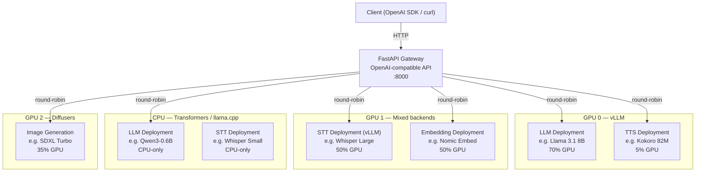

# Modelship

[](https://github.com/alez007/modelship/actions/workflows/ci.yml)
[](https://opensource.org/licenses/Apache-2.0)
[](https://www.python.org/downloads/)

Self-hosted, multi-model AI inference server. Runs LLMs alongside specialized models (TTS, speech-to-text, embeddings, image generation) on GPU or CPU, exposing an OpenAI-compatible API. Built on [Ray Serve](https://docs.ray.io/en/latest/serve/index.html) with pluggable inference backends: [vLLM](https://github.com/vllm-project/vllm) for high-throughput GPU inference, [HuggingFace Transformers](https://github.com/huggingface/transformers) for CPU and lightweight GPU workloads, [llama.cpp](https://github.com/abetlen/llama-cpp-python) for high-efficiency GGUF models on CPU, [Diffusers](https://github.com/huggingface/diffusers) for image generation, and a plugin system for custom backends.

## Why Modelship?

Most self-hosted inference tools focus on running a single model. Modelship is for when you need **multiple models running simultaneously** — an LLM, a TTS engine, a speech-to-text model, an embedding model, and an image generator — all behind a single OpenAI-compatible API, with fine-grained control over GPU memory allocation across them.

- **One server, many models** — run a full AI stack (chat + TTS + STT + embeddings + image gen) on a single machine instead of juggling separate services
- **GPU memory control** — allocate exact GPU fractions per model (e.g. 70% for the LLM, 5% for TTS) so everything fits on your hardware
- **Mix and match backends** — use vLLM for high-throughput GPU inference, Transformers or llama.cpp for CPU-only workloads, Diffusers for images, and plugins for custom backends — in the same deployment
- **Drop-in OpenAI replacement** — any OpenAI SDK client works out of the box, making it easy to integrate with existing apps and tools like [Home Assistant](docs/home-assistant.md)

## Architecture



Each model runs as an isolated [Ray Serve](https://docs.ray.io/en/latest/serve/index.html) deployment with its own lifecycle, health checks, and resource budget. Five inference backends are available:

| Backend | Best for | GPU required |
|---|---|---|
| **vLLM** | High-throughput chat, embeddings, transcription | Yes |
| **llama.cpp** | High-efficiency quantized GGUF models (chat, embeddings) | No |
| **Transformers** | Chat, embeddings, transcription, TTS on CPU or lightweight GPU | No |
| **Diffusers** | Image generation | Yes |
| **Custom (plugins)** | TTS backends (Kokoro ONNX, Bark, Orpheus), STT backends (whisper.cpp) | No |

Models can be deployed across multiple GPUs, run on CPU-only, or both — multiple deployments of the same model (e.g. one on GPU via vLLM, one on CPU via Transformers) are load-balanced with round-robin routing. Each deployment can also scale horizontally with `num_replicas`.
...

## Requirements

- **Docker** (or Python 3.12+ with `uv` for local development)
- **NVIDIA GPU** (optional) — 16 GB+ VRAM recommended for a full stack (LLM + TTS + STT + embeddings) via vLLM; 8 GB is sufficient for lighter setups. Not required when using the Transformers backend on CPU
- **[NVIDIA Container Toolkit](https://docs.nvidia.com/datacenter/cloud-native/container-toolkit/install-guide.html)** — required only when running GPU models in Docker
- **HuggingFace token** for gated models

## Features

- **Multi-model, multi-GPU** — run chat, embedding, STT, TTS, and image generation models simultaneously across one or more GPUs with tunable per-model GPU memory allocation
- **CPU-only support** — run models without a GPU using the Transformers backend (chat, embeddings, transcription, TTS). Useful for development, testing, or small models that don't need GPU acceleration
- **Multiple inference backends** — vLLM for high-throughput GPU inference, HuggingFace Transformers for CPU and lightweight GPU workloads, Diffusers for image generation, and a plugin system for custom backends
- **Per-model isolated deployments** — each model runs in its own Ray Serve deployment with independent lifecycle, health checks, failure isolation, and configurable replica count
- **OpenAI-compatible API** — drop-in replacement for any OpenAI SDK client
- **Streaming** — SSE streaming for chat completions and TTS audio
- **Tool/function calling** — auto tool choice with configurable parsers
- **Plugin system** — opt-in TTS and STT backends installed as isolated uv workspace packages
- **Multi-GPU & hybrid routing** — assign models to specific GPUs or run them on CPU-only; deploy the same model on both GPU and CPU and requests are load-balanced via round-robin; full tensor parallelism support for large models spanning multiple GPUs
- **Client disconnect detection** — cancels in-flight inference when the client disconnects, freeing GPU resources immediately
- **Prometheus metrics & Grafana dashboard** — built-in observability with custom `modelship:*` metrics, vLLM engine stats, and Ray cluster metrics on a single scrape endpoint; pre-built Grafana dashboard included
- **Ray dashboard** — monitor deployments, resources, and request logs

## Supported OpenAI Endpoints

| Endpoint | Usecase |
|---|---|
| `POST /v1/chat/completions` | Chat / text generation (streaming and non-streaming) |
| `POST /v1/embeddings` | Text embeddings |
| `POST /v1/audio/transcriptions` | Speech-to-text |
| `POST /v1/audio/translations` | Audio translation |
| `POST /v1/audio/speech` | Text-to-speech (SSE streaming or single-response) |
| `POST /v1/images/generations` | Image generation |
| `GET /v1/models` | List available models |

## Quick Start

The fastest way to try Modelship: run a quantized 7B chat model on a laptop — no GPU required. Copy-paste this block and you'll have an OpenAI-compatible API on `http://localhost:8000` in a few minutes (first run downloads ~4.5 GB of weights into `./models-cache`).

```bash
mkdir -p models-cache && cat > models.yaml <<'EOF'
models:
  - name: qwen
    model: lmstudio-community/Qwen2.5-7B-Instruct-GGUF
    usecase: generate
    loader: llama_cpp
    num_cpus: 3
    llama_cpp_config:
      hf_filename: "*Q4_K_M.gguf"
EOF

docker run --rm --shm-size=8g \
  -v ./models.yaml:/modelship/config/models.yaml \
  -v ./models-cache:/.cache \
  -p 8000:8000 \
  ghcr.io/alez007/modelship:latest-cpu
```

Images are multi-arch (amd64 + arm64), so this works on Apple Silicon and ARM Linux hosts too.

Once the server is up (look for `Deployed app 'modelship api' successfully`), call it:

```bash
curl http://localhost:8000/v1/chat/completions \
  -H "Content-Type: application/json" \
  -d '{"model": "qwen", "messages": [{"role": "user", "content": "Hello!"}]}'
```

Or point any OpenAI SDK at it — no code changes, just swap `base_url`:

```python
from openai import OpenAI

client = OpenAI(base_url="http://localhost:8000/v1", api_key="not-needed")
resp = client.chat.completions.create(
    model="qwen",
    messages=[{"role": "user", "content": "Hello!"}],
)
print(resp.choices[0].message.content)
```

### GPU (vLLM, Diffusers)

For high-throughput GPU inference, use the standard image and add `--gpus all`. You'll also need the [NVIDIA Container Toolkit](https://docs.nvidia.com/datacenter/cloud-native/container-toolkit/install-guide.html) and an `HF_TOKEN` for gated models. Example `models.yaml` entries for vLLM, Diffusers, and multi-GPU setups live in [docs/model-configuration.md](docs/model-configuration.md); ready-to-run configs are in [config/examples/](config/examples/).

```bash
docker run --rm --shm-size=8g --gpus all \
  -e HF_TOKEN=your_token_here \
  -v ./models.yaml:/modelship/config/models.yaml \
  -v ./models-cache:/.cache \
  -p 8000:8000 \
  ghcr.io/alez007/modelship:latest
```

Hitting an error? Check [docs/troubleshooting.md](docs/troubleshooting.md).

## Plugin Support

Modelship's TTS and STT systems are built around a plugin architecture — each backend is an opt-in package with its own isolated dependencies. Plugins ship inside this repo (`plugins/`) or can be installed from PyPI.

Built-in plugins:

- [Kokoro ONNX](plugins/kokoroonnx/README.md) — lightweight TTS via ONNX Runtime (CPU or GPU)
- [Bark](plugins/bark/README.md) — multilingual TTS by Suno (GPU recommended)
- [Orpheus](plugins/orpheus/README.md) — expressive TTS
- [whisper.cpp](plugins/whispercpp/README.md) — CPU-only STT via `pywhispercpp`

To enable plugins for local development, pass them as extras at sync time:

```bash
uv sync --extra kokoroonnx
uv sync --extra kokoroonnx --extra whispercpp  # multiple plugins
```

For deployment, plugins are automatically loaded from wheels via Ray's `runtime_env` when referenced in `models.yaml`.

For a full guide on writing your own plugin, see [Plugin Development](docs/plugins.md).

## Documentation

- [Development](docs/development.md) — dev environment setup, building, and running locally
- [Model Configuration](docs/model-configuration.md) — full `models.yaml` reference, GPU pinning, environment variables
- [Architecture](docs/architecture.md) — system design, request lifecycle, plugin loading
- [Plugin Development](docs/plugins.md) — writing custom TTS/STT backends
- [Home Assistant Integration](docs/home-assistant.md) — Wyoming protocol setup for voice automation
- [Monitoring & Logging](docs/monitoring.md) — Prometheus metrics, Grafana dashboard, structured logging, health checks
- [Troubleshooting](docs/troubleshooting.md) — common first-run errors and fixes
- [Roadmap](ROADMAP.md) — what's planned next and where to contribute

## Monitoring

Modelship exposes Prometheus metrics (Ray cluster, Ray Serve, vLLM, and custom `modelship:*` metrics) through a single scrape endpoint on port 8079. Metrics are **enabled by default** — set `MSHIP_METRICS=false` to disable. A pre-built Grafana dashboard is included.

Logging supports structured JSON output (`MSHIP_LOG_FORMAT=json`) and request ID correlation across Ray actor boundaries. Logs can be shipped to a remote syslog server (`--log-target syslog://host:514`) or an OpenTelemetry collector (`--otel-endpoint http://collector:4317`). Set `MSHIP_LOG_LEVEL` to `TRACE` for full request/response payloads, or `DEBUG` for detailed diagnostics without payloads.

See [Monitoring & Logging](docs/monitoring.md) for full details.

## Production Readiness

Modelship is actively used but not yet hardened for production. Key gaps today: no rate limiting, `/health` is a no-op, thin test coverage, no Helm chart, no Prometheus alerting rules. See the full [Production Readiness Plan](docs/production-readiness.md) for the scorecard and roadmap.

## Contributing

See [CONTRIBUTING.md](CONTRIBUTING.md) for guidelines on setting up the dev environment, code style, and submitting pull requests.
