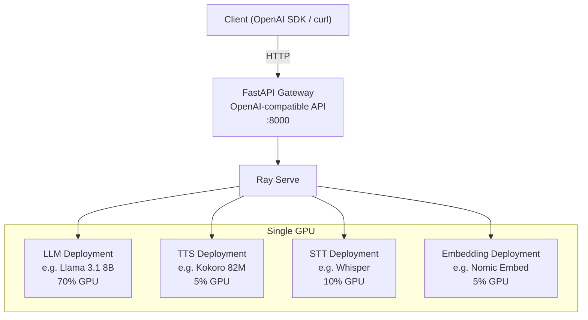

# Yasha

Self-hosted, multi-model AI inference server. Runs LLMs alongside specialized models (TTS, speech-to-text, embeddings, image generation) on one or more GPUs, exposing an OpenAI-compatible API. Built on [vLLM](https://github.com/vllm-project/vllm) and [Ray](https://github.com/ray-project/ray).

## Architecture



Each model runs as an isolated Ray Serve deployment with its own lifecycle, health checks, and GPU memory budget.

## Requirements

- **NVIDIA GPU** — 16 GB+ VRAM recommended for a full stack (LLM + TTS + STT + embeddings); 8 GB is sufficient for lighter setups
- **Docker** with [NVIDIA Container Toolkit](https://docs.nvidia.com/datacenter/cloud-native/container-toolkit/install-guide.html)
- **HuggingFace token** for gated models

## Features

- **Multi-model on a single GPU** — run chat, embedding, STT, TTS, and image generation models simultaneously with tunable per-model GPU memory allocation
- **Per-model isolated deployments** — each model runs in its own Ray Serve deployment with independent lifecycle, health checks, and failure isolation
- **OpenAI-compatible API** — drop-in replacement for any OpenAI SDK client
- **Streaming** — SSE streaming for chat completions and TTS audio
- **Tool/function calling** — auto tool choice with configurable parsers
- **Plugin system** — opt-in TTS backends installed as isolated uv workspace packages
- **Multi-GPU support** — assign models to specific GPUs by index or named Ray resource, with full tensor parallelism support
- **Client disconnect detection** — cancels in-flight inference when the client disconnects, freeing GPU resources immediately
- **Prometheus metrics & Grafana dashboard** — built-in observability with custom `yasha:*` metrics, vLLM engine stats, and Ray cluster metrics on a single scrape endpoint; pre-built Grafana dashboard included
- **Ray dashboard** — monitor deployments, resources, and request logs

## Supported OpenAI Endpoints

| Endpoint | Usecase |
|---|---|
| `POST /v1/chat/completions` | Chat / text generation (streaming and non-streaming) |
| `POST /v1/embeddings` | Text embeddings |
| `POST /v1/audio/transcriptions` | Speech-to-text |
| `POST /v1/audio/translations` | Audio translation |
| `POST /v1/audio/speech` | Text-to-speech (SSE streaming or single-response) |
| `POST /v1/images/generations` | Image generation |
| `GET /v1/models` | List available models |

## Quick Start

Pull the latest image from GHCR:

```bash
docker pull ghcr.io/alez007/yasha:latest
```

Grab an example config for your GPU and edit it to your liking:

```bash
docker run --rm ghcr.io/alez007/yasha:latest cat /yasha/config/models.example.16GB.yaml > models.yaml
```

Start the server:

```bash
docker run --rm --shm-size=8g --gpus all \
  -e HF_TOKEN=your_token_here \
  -e YASHA_PLUGINS=kokoro \
  -v ./models.yaml:/yasha/config/models.yaml \
  -v ./models-cache:/yasha/.cache/models \
  -p 8265:8265 -p 8000:8000 -p 8079:8079 ghcr.io/alez007/yasha:latest
```

Try it out:

```bash
curl http://localhost:8000/v1/chat/completions \
  -H "Content-Type: application/json" \
  -d '{
    "model": "your-model-name",
    "messages": [{"role": "user", "content": "Hello!"}]
  }'
```

- API: `http://localhost:8000`
- Prometheus metrics: `http://localhost:8079`
- Ray dashboard: `http://localhost:8265`

Example configs are included for 8 GB, 16 GB, 24 GB, and 2×16 GB GPU setups.

## Plugin Support

Yasha's TTS system is built around a plugin architecture — each TTS backend is an opt-in package with its own isolated dependencies. Plugins ship inside this repo (`plugins/`) or can be installed from PyPI.

To enable plugins, pass them as extras at sync time:

```bash
uv sync --extra kokoro
uv sync --extra kokoro --extra orpheus  # multiple plugins
```

When using Docker, set the `YASHA_PLUGINS` environment variable:

```
YASHA_PLUGINS=kokoro,orpheus
```

For a full guide on writing your own plugin, see [Plugin Development](docs/plugins.md).

## Documentation

- [Development](docs/development.md) — dev environment setup, building, and running locally
- [Model Configuration](docs/model-configuration.md) — full `models.yaml` reference, GPU pinning, environment variables
- [Architecture](docs/architecture.md) — system design, request lifecycle, plugin loading
- [Plugin Development](docs/plugins.md) — writing custom TTS backends
- [Home Assistant Integration](docs/home-assistant.md) — Wyoming protocol setup for voice automation
- [Monitoring](docs/monitoring.md) — Prometheus metrics, Grafana dashboard, health checks

## Monitoring

Yasha exposes Prometheus metrics (Ray cluster, Ray Serve, vLLM, and custom `yasha:*` metrics) through a single scrape endpoint on port 8079. Metrics are **enabled by default** — set `YASHA_METRICS=false` to disable. A pre-built Grafana dashboard is included. See [Monitoring](docs/monitoring.md) for setup details.

## Production Readiness

See the full [Production Readiness Plan](docs/production-readiness.md) for details. Summary of current status:

| Area                         | Score | Key Gaps |
|------------------------------|-------|----------|
| Architecture & Design        | 8/10  | Add K8s manifests, improve health checks |
| Monitoring (metrics)         | 9/10  | Excellent — Prometheus + Grafana ready |
| Monitoring (alerting + logs) | 4/10  | No alerting rules, no structured logging |
| Security                     | 4/10  | No rate limiting, open CORS, no plugin sandboxing |
| Resilience                   | 5/10  | Good shutdown, weak self-healing |
| Testing                      | 3/10  | Config tests only, no integration/API tests |
| DevOps Experience            | 5/10  | Good docs, no K8s/Helm, no runbooks |
| Update/Deploy Strategy       | 3/10  | No rolling updates, no hot-reload |

### Critical items before production

- Rate limiting per user/model
- Detailed readiness/liveness probes (current `/health` is a no-op)
- Integration and API test coverage
- Kubernetes manifests and Helm chart
- Prometheus alerting rules and SLO definitions

## Contributing

See [CONTRIBUTING.md](CONTRIBUTING.md) for guidelines on setting up the dev environment, code style, and submitting pull requests.
